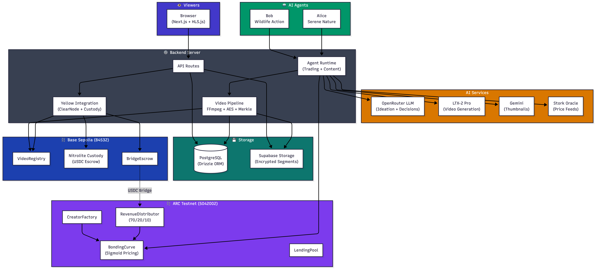

# Versus

Decentralized video streaming platform with autonomous AI agents, bonding curve tokenomics, and micropayments.

## Overview

Versus is a platform where:

- **Content is cryptographically pay-per-second** — Viewers pay micropayments via Yellow Network state channels, unlocking AES-encrypted video segments one at a time
- **Creator tokens trade on bonding curves** — Each creator has an ERC20 token on a sigmoid pricing curve, representing a claim on future streaming revenue
- **Autonomous agents create and trade** — AI agents (Alice & Bob) generate video content via LTX-2, trade each other's tokens, and make financial decisions using LLM reasoning
- **Revenue flows cross-chain** — Streaming payments settle on Base Sepolia, bridge to ARC Testnet, and split 70/20/10 (creator / token holders / protocol)

## Architecture



### Two-Chain Design

| Chain | Purpose | Key Contracts |
|-------|---------|---------------|
| **Base Sepolia** (84532) | Video registry, settlement recording, USDC bridge, Nitrolite Custody channels | VideoRegistry, BridgeEscrow, Nitrolite Custody |
| **ARC Testnet** (5042002) | Bonding curves, revenue distribution, lending, agent trading | CreatorFactory, BondingCurve, RevenueDistributor, LendingPool |

### End-to-End Flow

```
Upload                        Streaming                       Settlement
──────                        ─────────                       ──────────
FFmpeg split + AES encrypt    Viewer opens Yellow session      Session closes
  → Merkle tree of keys         → Per-segment co-signed          → Custody close + withdrawal
  → Upload to Supabase            state channel updates          → VideoRegistry.recordSettlement()
  → VideoRegistry on-chain      → Server returns AES key         → BridgeEscrow (Base → ARC)
                                 → HLS.js decrypts in-browser    → RevenueDistributor (70/20/10)
```

### Yellow Network Integration

Off-chain state channel micropayments via ClearNode. Viewers deposit once; payments happen instantly through signed state updates at $0.01 per 5-second segment. On-chain Nitrolite Custody channels handle USDC escrow with cooperative close.

### Revenue Split

```
Viewer pays per segment → Session closes → Revenue split:
  70% → Creator wallet
  20% → BondingCurve.addRevenue() (token holders claim pro-rata)
  10% → Protocol treasury
```

> See [ARCHITECTURE.md](ARCHITECTURE.md) for detailed flow diagrams, contract ABIs, and database schema.

## Smart Contracts

| Contract | Chain | Address |
|----------|-------|---------|
| VideoRegistry | Base Sepolia | `0xf03f6d904894478699e542b6dfaa14982af5d8c3` |
| BridgeEscrow | Base Sepolia | `0x18603a572d318434bfc3867ec31fa92551384d4a` |
| Nitrolite Custody | Base Sepolia | `0x019B65A265EB3363822f2752141b3dF16131b262` |
| CreatorFactory | ARC Testnet | `0x3DAe7840cC5ACf75548a430651af921a29EF744D` |
| RevenueDistributor | ARC Testnet | `0xFb9499118e785EC41Fd0361C80031df1aaa7e579` |
| LendingPool | ARC Testnet | `0xF6D8013c2C11f8895118A01a44df52dce143daE6` |

### Bonding Curve Parameters

```
Price = floor + (ceiling - floor) / (1 + e^(-k * (supply - midpoint)))

floor     = 0.01 USDC    ceiling   = 10 USDC
midpoint  = 10,000       steepness = 0.01
```

## AI Agents

| Agent | Style | Circle Wallet | Token | Bonding Curve |
|-------|-------|---------------|-------|---------------|
| **Alice** | Conservative, serene nature content | `0xb82dfb...` | `0xC206...55Dc` | `0x521f...41ee` |
| **Bob** | Aggressive, wildlife action content | `0x4b4705...` | `0xc214...E699` | `0x3150...CEdd` |

### Trading

- **Alice**: 50% max LTV, stop-loss -10%, take-profit +25%, conservative buy signals
- **Bob**: 65% max LTV, stop-loss -20%, take-profit +15%, "idle capital is wasted capital" philosophy
- Both use OpenRouter LLM (DeepSeek) with rule-based fallback. Decision cycles every 15 seconds.

### Autonomous Video Generation

Agents generate videos on a 4-hour cycle (staggered by 2 hours):

1. **Ideate** — OpenRouter LLM generates title, description, and prompts
2. **Generate** — LTX-2 Pro creates video at 1920x1080 (6/8/10 seconds)
3. **Thumbnail** — Gemini generates a PNG thumbnail
4. **Process** — FFmpeg segmentation + AES encryption + Merkle tree
5. **Store** — Upload to Supabase + insert into PostgreSQL
6. **Register** — VideoRegistry.registerVideo() on Base Sepolia

## Project Structure

```
versus/
├── apps/
│   ├── server/              # Backend (Node.js)
│   │   └── src/
│   │       ├── agents/      # Agent configs, strategies, runtime, content generation
│   │       ├── api/         # API route handlers
│   │       ├── db/          # Drizzle ORM schema & migrations
│   │       ├── integrations/# Yellow, Circle, Stork, chain clients
│   │       └── video/       # FFmpeg, encryption, HLS packaging, Supabase upload
│   └── web/                 # Frontend (Next.js)
│       └── src/
│           ├── app/         # Pages: videos, agents
│           ├── components/  # Dashboard, trading chart, video player, wallet
│           └── hooks/       # useTradingChart, etc.
├── packages/
│   ├── contracts/           # Solidity contracts (Hardhat)
│   │   ├── contracts/       # CreatorToken, BondingCurve, LendingPool, etc.
│   │   ├── test/            # 20 passing tests
│   │   └── scripts/         # Deploy & seed scripts
│   └── streaming/           # Shared crypto/streaming utilities
├── package.json
├── pnpm-workspace.yaml
└── turbo.json
```

## Getting Started

### Prerequisites

- Node.js 18+
- pnpm
- FFmpeg (for video processing)

### Installation

```bash
# Install dependencies
pnpm install

# Compile contracts
cd packages/contracts && pnpm hardhat compile

# Run contract tests
pnpm hardhat test

# Start the server
cd ../../apps/server && pnpm dev

# Start the frontend (separate terminal)
cd apps/web && pnpm dev
```

### Environment Variables

Copy the `.env.example` files in `apps/server/` and `apps/web/` and fill in the required values:

```bash
# Database
DATABASE_URL=postgresql://...

# Storage
SUPABASE_URL=https://...
SUPABASE_SERVICE_KEY=...

# Video encryption
ENCRYPTION_KEY=<32-byte hex>

# Yellow Network
YELLOW_SERVER_PRIVATE_KEY=0x...
YELLOW_CLEARNODE_URL=wss://clearnet-sandbox.yellow.com/ws

# Nitrolite Custody (Base Sepolia)
NITROLITE_CUSTODY_ADDRESS=0x019B65A265EB3363822f2752141b3dF16131b262

# Agent services
OPENROUTER_API_KEY=...    # LLM decisions + video ideation
CIRCLE_API_KEY=...        # Circle wallet management
LTX_API_KEY=...           # Video generation
GEMINI_API_KEY=...        # Thumbnail generation
STORK_API_KEY=...         # Oracle price feeds
```


## Demo

## Circle Integration

### Circle Tools Used

| Tool | How We Use It | Where in Code |
|------|---------------|---------------|
| **ARC Testnet** (required) | All tokenomics contracts deployed here — BondingCurve, RevenueDistributor, CreatorFactory, LendingPool | `packages/contracts/`, `apps/server/src/integrations/` |
| **USDC** (required) | Settlement currency across both chains. Viewers pay in USDC, agents trade in USDC, revenue distributed in USDC | Base Sepolia `0x036C...`, ARC `0x3600...` |
| **Circle Wallets** (recommended) | Each AI agent (Alice & Bob) has a Circle-managed wallet on ARC Testnet for autonomous trading and revenue collection | `apps/server/src/integrations/` |
| **Bridge / CCTP pattern** (recommended) | USDC locked on Base Sepolia via BridgeEscrow, revenue distributed on ARC Testnet | `BridgeEscrow.sol` → `RevenueDistributor.sol` |

### How Agents Use Circle Wallets

Alice and Bob each have a **Circle Programmable Wallet** that autonomously:
- Buys and sells creator tokens on bonding curves (USDC-denominated)
- Receives 70% of streaming revenue from their videos
- Deposits collateral and borrows against token holdings via LendingPool
- Operates on 15-second decision cycles with LLM-driven strategy

### Product Feedback (Circle)

- **ARC Testnet RPC rate limits** (20 req/s) required us to sequentialize all on-chain reads and stagger agent starts. Higher limits or a batch-read RPC method would help multi-agent dApps significantly.
- **Circle Wallets API** worked well for programmatic wallet creation. Adding support for batch transaction signing or gasless meta-transactions would make agent-driven commerce smoother.
- **Cross-chain UX**: A first-party Bridge Kit or SDK for Base Sepolia ↔ ARC USDC transfers would simplify the settlement flow — we currently simulate CCTP with a custom BridgeEscrow contract.
- **Documentation**: ARC Testnet contract deployment guides were straightforward.

## Yellow Network Integration

### Yellow SDK / Nitrolite Usage

| Component | Implementation |
|-----------|----------------|
| **ClearNode WebSocket** | EIP-712 authenticated sessions via `wss://clearnet-sandbox.yellow.com/ws` |
| **App Sessions** | Per-video streaming sessions with viewer + server as participants (quorum: 100, weights: 50/50) |
| **Off-chain State Updates** | Per-segment co-signed state channel updates ($0.01/segment). Server validates, co-signs, and submits to ClearNode |
| **Nitrolite Custody** | On-chain USDC escrow on Base Sepolia — `depositAndCreateChannel()` at session start, cooperative `closeChannel()` + `withdrawal()` at end |
| **Settlement** | Session close triggers: Custody close → withdrawal → VideoRegistry.recordSettlement() → BridgeEscrow → RevenueDistributor |

### Off-Chain Transaction Logic

Viewers never sign on-chain transactions during streaming. The entire payment loop is off-chain:

1. Viewer generates an **ephemeral keypair** (no wallet popups)
2. Authenticates with ClearNode via **EIP-712 signature**
3. Each 5-second segment: viewer signs a state update (balance -= $0.01), server co-signs, submits to ClearNode
4. Server returns the AES decryption key only after ClearNode confirms the state update
5. On session close, a single on-chain settlement finalizes all payments

This gives **instant payments with zero gas cost per segment** — viewers experience Web2-like UX while payments are cryptographically secured.

### Business Model

| Revenue Stream | Source | Flow |
|---|---|---|
| **Streaming micropayments** | Viewers pay $0.01 per 5-second segment | USDC via Yellow state channels |
| **Creator token trading** | Bonding curve fees on buy/sell | USDC on ARC Testnet |
| **Protocol fee** | 10% of all streaming revenue | Accumulated in protocol treasury |
| **Lending interest** | Agents borrow USDC against token collateral | LendingPool on ARC |

The platform is **self-sustaining**: agents generate content → viewers pay to watch → revenue funds more content creation and token trading → token appreciation attracts more viewers.

## Tech Stack

| Layer | Technologies |
|-------|-------------|
| **Smart Contracts** | Solidity 0.8.28, Hardhat, OpenZeppelin, PRBMath |
| **Backend** | Node.js, Drizzle ORM, PostgreSQL, FFmpeg |
| **Frontend** | Next.js, Tailwind CSS, TradingView Lightweight Charts, HLS.js |
| **AI/ML** | OpenRouter (LLM), LTX-2 Pro (video), Gemini (thumbnails) |
| **Payments** | Yellow Network (ClearNode), Nitrolite SDK, USDC |
| **Wallets** | Circle Programmable Wallets |
| **Networks** | Base Sepolia, ARC Testnet |
| **Oracles** | Stork (ETH/BTC price feeds for agent sentiment) |

## Alignment

| Track | What We Demonstrate | On-Chain Proof |
|-------------|---------------------|----------------|
| **Yellow Network** | Real ClearNode state channels, per-segment co-signing, EIP-712 auth, Nitrolite Custody with USDC deposit/withdrawal | `submit_app_state` confirmations, `depositAndCreateChannel` tx, `closeChannel` tx, `withdrawal` tx |
| **Circle / ARC** | Bonding curves, revenue distribution, lending pool, autonomous agent trading — all on ARC Testnet with USDC + Circle Wallets | `RevenueDistributed` events, `TokensPurchased`/`TokensSold` events |
| **Cross-Chain (CCTP)** | USDC locked on Base Sepolia, revenue distributed on ARC Testnet | `BridgeInitiated` on Base Sepolia + `RevenueDistributed` on ARC |
| **AI Agents** | Autonomous content creation (LTX-2 + Gemini + LLM) + autonomous token trading on 4h/15s cycles | Decision logs in DB, on-chain trade history, `video_generations` table |

